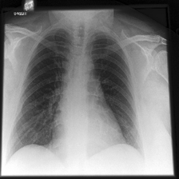
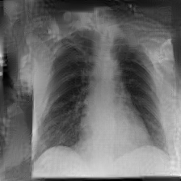

# Reconstruction Attack on Federated Learning Models for X-Ray Classification

Application of the _Deep Leakage from Gradients_ attack to trained model parameters, used for recovering images from local federated learning models trained on X-ray image classification ( [cxr-fl-privacy](https://github.com/linev8k/cxr-fl-privacy)). 

## Setup

Create and activate a conda environment with
```sh
conda env create -f environment.yml
conda activate cxr
```
This environment also enables federated learning experiments from [cxr-fl-privacy](https://github.com/linev8k/cxr-fl-privacy).

## Script Usage

The main script for running the attack is ```reconstruct_cxr.py```.

There are helper bash scripts for running the main script (```run_rec.sh```) and clearing results (```clear_results.sh```).

Example from ```run_rec.sh```:

```sh
python3 reconstruct_cxr.py --model DenseNet121 --name dense_test --dataset ImageNet --optimizer adam --num_images 2 --save_image --deterministic
```

Note that some original bash arguments from ```inversefed/options.py``` will be overwritten by variables in the script. Check ```reconstruct_cxr.py``` for possible bash parameter specifications.

## Attack Configuration

See ```reconstruct_cxr.py``` for parameter specification options. Example options are whether to infer gradients from given model parameters, model layer freezing, and attack settings, e.g., maximum iterations and dummy image intialization. 

If gradients are inferred from trained model parameters, specify the model path variables ```init_model_path``` and ```trained_model_path``` and provide a path to a CSV file for reading the ground truth images. Otherwise, image paths and labels can be provided for a demo mode where original gradients are directly computed before reconstruction. 

## Result Output

```
.
├── trial_histories 							# tracking the reconstruction process
|		└── trial0.csv 								# loss, mse, psnr per trial
|		└── trial0_img0_history.png		# visualization of reconstruction process per image
|		└── ... 		
├── tables 											 	# parameter documentation
|	  └── table_exp.csv
├──	images 												# best trial
|		└── gt_idx0.png								# ground truth image
|	  └── rec_exp0_idx0.png					# best reconstructed image
|	  └── ...
├── images_all								 		# reconstructed images from all trials
|	  └── rec_exp1_idx0.png
|	  └── rec_exp2_idx0.png
|	  └── ...
```

## Reconstruction Example

Original (left) and reconstructed (right) CheXpert image from DenseNet12 model trained with four images, after four federated rounds

 


## Acknowledgements

* Modified ```inversefed``` module from the [Inverting Gradients](https://github.com/JonasGeiping/invertinggradients) publication by Geiping et al.

* Example X-rays from [CheXpert](https://stanfordmlgroup.github.io/competitions/chexpert/) and [Mendeley](https://data.mendeley.com/datasets/rscbjbr9sj/3)
